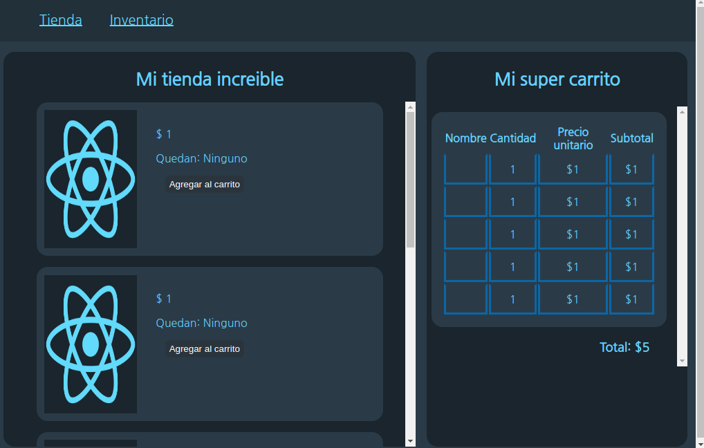

# My store amazing 

## Screenshot


## Instruction of installation

1. Install dependencies

```shell
$ yarn
```

2. Run server

```shell
$ yarn start
```

3. Open project in browser

    [http://localhost:3000](http://localhost:3000)


At the beginning, only the empty store will appear, so you have to add products in the inventory and immediately these will be available in the store. Once in the store, the products can be added to the cart until they are sold out.


New contributor: [Johan Castillo](https://instagram.com/jcboxing2707)
